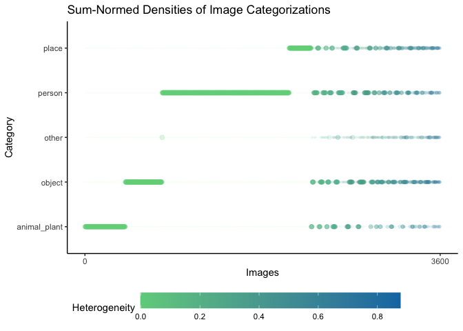
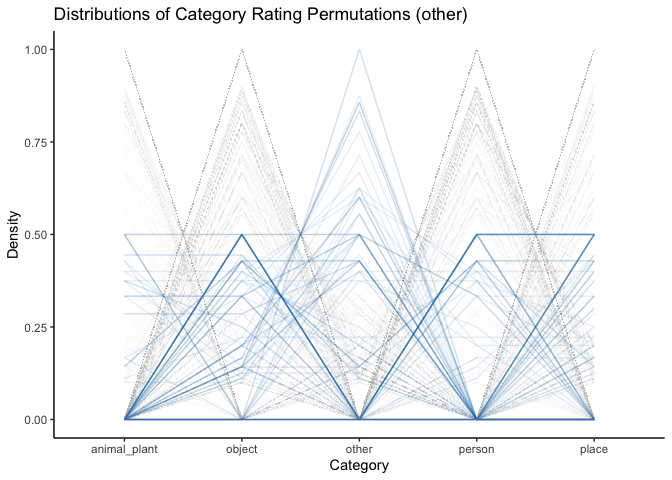

Categorization Analysis
=======================

Load packages
-------------

``` r
library(dplyr)
library(purrr)
library(tidyr)
library(ggplot2)
library(hash)
library(GGally)
```

Constants
---------

``` r
VALIDATION_THRESHOLD = 3

# Colors for plotting
COLORS <- hash()
COLORS[["WHITE"]] <- "#FFFFFF"
COLORS[["BLACK"]] <- "#2F2F2F"
COLORS[["GRAY"]] <- "#5C6D70"
COLORS[["LIGHT_GRAY"]] <- "#CDD5D1"
COLORS[["BLUE"]] <- "#0E79B2"
COLORS[["GREEN"]] <- "#6FD08C"
COLORS[["ORANGE"]] <- "#F39237"

# For formatting doubles
options(digits = 2)
```

Set datapath and load `shlab.imgct`
-----------------------------------

Begin by setting the working directory and important top-level paths to
data and loading necessary packages.

-   NOTE: This will be changed to dynamically account for the package
    `shlab.imgct` via its GitHub instance later. For now, it is using
    development loading.

``` r
# Set the working directory to be part of S Drive (may make dynamic later?)
# Whilst not dynamic, change for own session if mount point is not equivalent on
# local machine
shared_dir <- "~/Projects/shlab/mounts/imgct"
package_dir <- "~/Projects/shlab"

datapath <- file.path(shared_dir, "csn_images")
imgct_package_path <- file.path(package_dir, "shlab.imgct")

# Make sure that devtools, tidyverse are installed before this call
devtools::load_all(imgct_package_path)
```

Load category data
------------------

``` r
counted_responses_cols = readr::cols(
  image_id = readr::col_character(),
  .default = readr::col_integer()
)

counted_df <- shlab.imgct::load_result(datapath, 
                                       stringr::str_c("categorized_", VALIDATION_THRESHOLD, "_valid"), 
                                       columns = counted_responses_cols)

# Determine category names from table
category_names <- counted_df %>% 
  dplyr::select(-c(image_id, n_ratings)) %>%
  names()

# Include max_rating for further analyses
counted_df <- counted_df %>%
  dplyr::mutate(
    max_rating = pmax(!!!rlang::syms(category_names)),
    rel_max_rating = max_rating / n_ratings
  )

# Include htg_index
counted_df <- counted_df %>%
  dplyr::mutate(
    htg_index = dplyr::select(., all_of(category_names)) %>%
      purrr::pmap_dbl(~shlab.imgct::calculate_htg_index(c(...)))
    )

knitr::kable(
  tail(counted_df)
)
```

| image\_id                  |  Person|  Animal/Plant|  Object|  Place|  Other|  n\_ratings|  max\_rating|  rel\_max\_rating|  htg\_index|
|:---------------------------|-------:|-------------:|-------:|------:|------:|-----------:|------------:|-----------------:|-----------:|
| OASIS\_snake\_5.jpg        |       0|             7|       0|      0|      0|           7|            7|              1.00|        0.00|
| OASIS\_stingray\_3.jpg     |       0|             7|       0|      0|      0|           7|            7|              1.00|        0.00|
| OASIS\_thunderstorm\_9.jpg |       0|             0|       2|      4|      1|           7|            4|              0.57|        0.59|
| OASIS\_tiger\_2.jpg        |       0|             6|       1|      0|      0|           7|            6|              0.86|        0.26|
| OASIS\_toast\_1.jpg        |       0|             0|       7|      0|      0|           7|            7|              1.00|        0.00|
| OASIS\_wall\_4.jpg         |       0|             0|       1|      4|      2|           7|            4|              0.57|        0.59|

Threshold-based Categorization
------------------------------

Functions for evaluating the harsh and semi-harsh threshold types of
categorization for a given image based on number of responses.

``` r
# Function to choose category with harsh threshold for maximum
#   - Does not allow for ties, only unique maximum as named category or Other.
choose_category_max_threshold <- function(ratings) {
  
  # count number of ratings equal to maximum rating
  n_max <- length(which(ratings == max(ratings)))
  if (n_max > 1) {
    return("Other")
  } else {
    return(names(ratings)[which.max(ratings)])
  }
  
}

# Function to choose category with semi-harsh threshold for maximum
#   - Does allow for ties, so unique maximum as named category, tied maxima as list category, or Other.
choose_category_ties_threshold <- function(ratings) {
  return(stringr::str_c(
    names(ratings)[which(ratings == max(ratings))],
    collapse=" & "
  ))
}
```

Determine the category dataframe including both the harsh
(category\_max) and semi-harsh (category\_ties) columns, which are
character and list of character types respectively.

``` r
category_df <- counted_df %>%
  dplyr::mutate(
    
    category_max = dplyr::select(., category_names) %>%
      purrr::pmap_chr(
        ., 
        ~ choose_category_max_threshold(c(...))
      ),
    
    category_ties = dplyr::select(., category_names) %>%
      purrr::pmap_chr(
        .,
        ~ choose_category_ties_threshold(c(...))
      )
    
  ) %>%
  dplyr::select(image_id, category_max, category_ties)
```

    ## Note: Using an external vector in selections is ambiguous.
    ## ℹ Use `all_of(category_names)` instead of `category_names` to silence this message.
    ## ℹ See <https://tidyselect.r-lib.org/reference/faq-external-vector.html>.
    ## This message is displayed once per session.

``` r
knitr::kable(
  head(category_df)
)
```

| image\_id      | category\_max | category\_ties |
|:---------------|:--------------|:---------------|
| IAPS\_1033.jpg | Animal/Plant  | Animal/Plant   |
| IAPS\_1310.jpg | Animal/Plant  | Animal/Plant   |
| IAPS\_1390.jpg | Animal/Plant  | Animal/Plant   |
| IAPS\_1617.jpg | Animal/Plant  | Animal/Plant   |
| IAPS\_1660.jpg | Animal/Plant  | Animal/Plant   |
| IAPS\_1750.jpg | Animal/Plant  | Animal/Plant   |

### Plot Harsh Categories

``` r
p <- ggplot(category_df, aes(x=category_max)) +
  geom_bar(color=COLORS[["GRAY"]], fill=COLORS[["BLUE"]], alpha=0.7)

p + labs(title="Distribution of Harsh Categorization Counts", x="Category", y="Count") +
  theme_classic() 
```


### Plot Semi-Harsh Categories

``` r
p <- ggplot(category_df, aes(y=category_ties)) +
  geom_bar(color=COLORS[["GRAY"]], fill=COLORS[["ORANGE"]], alpha=0.7)

p + labs(title="Distribution of Semi-Harsh Categorization Counts", x="Count", y="Category") +
  theme_classic() 
```


``` r
only_ties_df <- category_df %>%
  dplyr::filter(!(category_ties %in% c(category_names)))

p <- ggplot(only_ties_df, aes(y=category_ties)) +
  geom_bar(color=COLORS[["GRAY"]], fill=COLORS[["ORANGE"]], alpha=0.7)

p + labs(title="Distribution of Category Ties", x="Count", y="Category") +
  theme_classic()
```


Normalization-based Categorization
----------------------------------

### Sum normalization

``` r
normalized_sum_df <- counted_df %>%
  dplyr::mutate_at(vars(category_names), ~ . / n_ratings) %>%
  dplyr::select(-c(n_ratings, max_rating))

knitr::kable(
  head(normalized_sum_df)
)
```

| image\_id      |  Person|  Animal/Plant|  Object|  Place|  Other|  rel\_max\_rating|  htg\_index|
|:---------------|-------:|-------------:|-------:|------:|------:|-----------------:|-----------:|
| IAPS\_1033.jpg |       0|             1|       0|      0|      0|                 1|           0|
| IAPS\_1310.jpg |       0|             1|       0|      0|      0|                 1|           0|
| IAPS\_1390.jpg |       0|             1|       0|      0|      0|                 1|           0|
| IAPS\_1617.jpg |       0|             1|       0|      0|      0|                 1|           0|
| IAPS\_1660.jpg |       0|             1|       0|      0|      0|                 1|           0|
| IAPS\_1750.jpg |       0|             1|       0|      0|      0|                 1|           0|

### Pivot Sum-Normed Categories to Longer

``` r
norm_sum_long <- normalized_sum_df %>% 
  tidyr::pivot_longer(
    -c(image_id, htg_index),
    names_to = "category",
    values_to = "density"
  ) %>%
  dplyr::arrange(desc(density), category) %>%
  dplyr::mutate(image_sort_id = match(image_id, unique(image_id))) %>%
  dplyr::arrange(category, desc(density)) %>%
  dplyr::relocate(image_sort_id, .after = image_id)
```

### Plot Sum-Normalization

``` r
p <- ggplot(norm_sum_long, aes(x=image_sort_id, y=category, alpha=density, size=density)) +
  geom_point(aes(color = htg_index))

p <- p + labs(
    title = "Sum-Normed Densities of Image Categorizations",
    x = "Images",
    y = "Category",
    color = "Heterogeneity"
  ) +
  scale_x_continuous(breaks = c(0, 3600)) +
  scale_alpha_continuous(range = c(0.005, 0.1)) +
  scale_size_continuous(range = c(0,2)) +
  scale_color_gradient(low = COLORS[["GREEN"]], high = COLORS[["BLUE"]]) +
  guides(
    alpha = FALSE,
    size = FALSE
  ) +
  theme_classic() +
  theme(
    legend.position = "bottom",
    legend.justification = c("left"),
    legend.key.width = unit(2, "cm")
  )

p
```



``` r
p <- ggplot(norm_sum_long %>% dplyr::filter(htg_index > 0), aes(x=image_sort_id, y=category, alpha=density, size=density)) +
  geom_point(aes(color = htg_index))

p <- p + labs(
    title = "Sum-Normed Densities of Image Categorizations (Non-Homogeneous)",
    x = "Images",
    y = "Category",
    color = "Heterogeneity"
  ) +
  scale_alpha_continuous(range = c(0.005, 0.1)) +
  scale_size_continuous(range = c(0,2)) +
  scale_color_gradient(low = COLORS[["GREEN"]], high = COLORS[["BLUE"]]) +
  guides(
    alpha = FALSE,
    size = FALSE
  ) +
  theme_classic() +
  theme(
    #axis.text.x = element_blank(),
    legend.position = "bottom",
    legend.justification = c("left"),
    legend.key.width = unit(2, "cm")
  )

p
```


### Combine Categorization Methods

Alphabetize categories and combine sum-normed categorizations with harsh
threshold categorizations.

``` r
alphabetized_category_names <- sort(category_names)

combined_categorization_df <- normalized_sum_df %>%
  dplyr::inner_join(category_df, by = "image_id") %>%
  dplyr::select(-c(rel_max_rating)) %>%
  dplyr::mutate_at(
    vars(category_max),
    ~ as.factor(.x)
  ) %>%
  dplyr::filter(htg_index != 0) %>%
  # relocate by alphabetical order for plotting
  dplyr::relocate(all_of(alphabetized_category_names))

knitr::kable(
  head(combined_categorization_df)
)
```

|  Animal/Plant|  Object|  Other|  Person|  Place| image\_id      |  htg\_index| category\_max | category\_ties |
|-------------:|-------:|------:|-------:|------:|:---------------|-----------:|:--------------|:---------------|
|             0|       0|   0.00|    0.50|   0.50| IAPS\_2217.jpg |        0.56| Other         | Person & Place |
|             0|       0|   0.00|    0.88|   0.12| IAPS\_2410.jpg |        0.23| Person        | Person         |
|             0|       0|   0.12|    0.88|   0.00| IAPS\_2681.jpg |        0.23| Person        | Person         |
|             0|       0|   0.12|    0.88|   0.00| IAPS\_3062.jpg |        0.23| Person        | Person         |
|             0|       0|   0.00|    0.50|   0.50| IAPS\_5831.jpg |        0.56| Other         | Person & Place |
|             0|       0|   0.38|    0.00|   0.62| IAPS\_5940.jpg |        0.45| Place         | Place          |

### Plot Categorizations by Parallel Coordinates

``` r
parallel_coordinates_plotter <- function(.category = "Person") { # "Person" default
  combined_categorization_df$alpha <- c(0.01, .1)[
      1 + (alphabetized_category_names %in% .category)
    ][combined_categorization_df$category_max]
  
  combined_categorization_df$size <- c(0.1)[combined_categorization_df$category_max]
  
  color_vec <- c(COLORS[["LIGHT_GRAY"]], COLORS[["BLUE"]])[
      1 + (alphabetized_category_names %in% .category)
    ]
  
  p <-  GGally::ggparcoord(
      data = combined_categorization_df,
      columns = alphabetized_category_names,
      groupColumn = "category_max",
      order = 1:(length(alphabetized_category_names) + 1),
      scale = "globalminmax",
      showPoints = FALSE,
      alphaLines = "alpha"
    )
  
  p <- p + labs(
      title = stringr::str_c("Distributions of Category Rating Permutations (", .category, ")"),
      x = "Category",
      y = "Density"
    ) +
    scale_color_manual(values = color_vec) +
    theme_classic() +
    theme(
      legend.position = "none"
    )
  
  p
}
```

``` r
purrr::map(alphabetized_category_names, parallel_coordinates_plotter)
```



### Max-Normalization

``` r
normalized_max_df <- counted_df %>%
  dplyr::mutate_at(vars(category_names), ~ . / max_rating) %>%
  dplyr::select(-c(n_ratings, max_rating))

knitr::kable(
  head(normalized_max_df)
)
```

| image\_id      |  Person|  Animal/Plant|  Object|  Place|  Other|  rel\_max\_rating|  htg\_index|
|:---------------|-------:|-------------:|-------:|------:|------:|-----------------:|-----------:|
| IAPS\_1033.jpg |       0|             1|       0|      0|      0|                 1|           0|
| IAPS\_1310.jpg |       0|             1|       0|      0|      0|                 1|           0|
| IAPS\_1390.jpg |       0|             1|       0|      0|      0|                 1|           0|
| IAPS\_1617.jpg |       0|             1|       0|      0|      0|                 1|           0|
| IAPS\_1660.jpg |       0|             1|       0|      0|      0|                 1|           0|
| IAPS\_1750.jpg |       0|             1|       0|      0|      0|                 1|           0|

### Pivot Max-Normed Categories to Longer

``` r
max_long <- normalized_max_df %>% 
  tidyr::pivot_longer(
    -image_id,
    names_to = "category",
    values_to = "density"
  )

knitr::kable(
  head(max_long)
)
```

| image\_id      | category         |  density|
|:---------------|:-----------------|--------:|
| IAPS\_1033.jpg | Person           |        0|
| IAPS\_1033.jpg | Animal/Plant     |        1|
| IAPS\_1033.jpg | Object           |        0|
| IAPS\_1033.jpg | Place            |        0|
| IAPS\_1033.jpg | Other            |        0|
| IAPS\_1033.jpg | rel\_max\_rating |        1|
