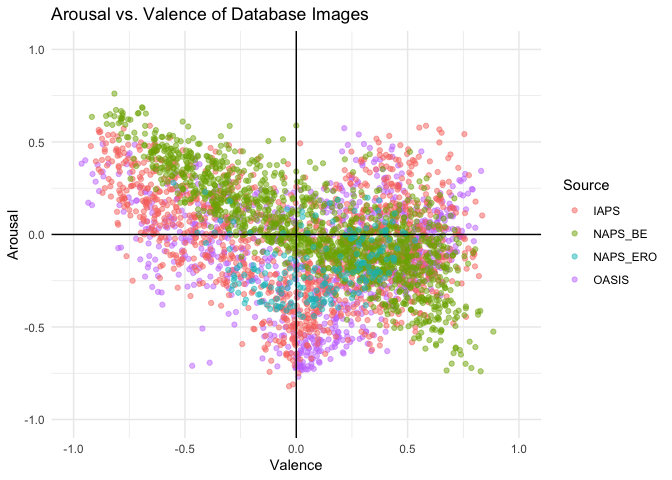

Emotion Rating Database Analysis
================================

Load packages
-------------

``` r
library(dplyr)
library(purrr)
library(tidyr)
library(stringr)
library(ggplot2)
library(hash)
library(scales)
library(readr)
```

Constants
---------

``` r
# Prevalence measures
HOMOSEXUAL_PREVALENCE <- 0.1
HETEORSEXUAL_PREVALENCE <- 0.9
HOMOSEXUAL_TAG <- "_ho"

# Database details
DB_SCALES <- hash()
DB_SCALES[["OASIS"]] <- c(1, 7)
DB_SCALES[["IAPS"]] <- c(1, 9)
DB_SCALES[["NAPS_BE"]] <- c(1, 9)
DB_SCALES[["NAPS_ERO"]] <- c(1, 9)

# Output rating scale
POS_NEG_RANGE <- c(-1, 1)

# For formatting doubles
options(digits = 2)
```

Set datapath and load `shlab.imgct`
-----------------------------------

Begin by setting the working directory and important top-level paths to
data and loading necessary packages.

-   NOTE: This will be changed to dynamically account for the package
    `shlab.imgct` via its GitHub instance later. For now, it is using
    development loading.

``` r
# Set the working directory to be part of S Drive (may make dynamic later?)
# Whilst not dynamic, change for own session if mount point is not equivalent on
# local machine
shared_dir <- "~/Projects/shlab/mounts/imgct"
package_dir <- "~/Projects/shlab"

datapath <- file.path(shared_dir, "csn_images")
imgct_package_path <- file.path(package_dir, "shlab.imgct")

# Make sure that devtools, tidyverse are installed before this call
devtools::load_all(imgct_package_path)
```

Load Database Imports
---------------------

``` r
oasis_df <- shlab.imgct::load_imported_xlsx(datapath, "oasis_emotion_ratings")
iaps_df <- shlab.imgct::load_imported_xlsx(datapath, "iaps_emotion_ratings")
naps_be_df <- shlab.imgct::load_imported_xlsx(datapath, "naps_be_emotion_ratings")
naps_ero_df <- shlab.imgct::load_imported_xlsx(datapath, "naps_ero_emotion_ratings")
```

Handle General Ratings for NAPS ERO Dataset
-------------------------------------------

Provided that NAPS ERO has specified arousal and valence ratings for
four groups, but no general rating of arousal and valence, we must
choose an averaging strategy. We will attempt a weighted average with
rough prevelance estimates, based on these four groups:

1.  HoF (Homosexual Female)
2.  HoM (Homosexual Male)
3.  HeF (Heterosexual Female)
4.  HeM (Heterosexual Male)

Constants for prevalence are determined above, and below is a function
for weighted ratings based upon the columns of NAPS ERO where "\_ho" and
"\_he" are tags for homosexual and heterosexual, respectively.

``` r
weighted_rating <- function(ratings) {
  columns <- names(ratings)
  
  # Weights are distributed to tags such that:
  #   - FALSE = HETEROSEXUAL_PREVALENCE
  #   - TRUE = HOMOSEXUAL_PREVALENCE
  weights <- c(
    HETEORSEXUAL_PREVALENCE,
    HOMOSEXUAL_PREVALENCE
  )
  
  tags <- stringr::str_detect(columns, HOMOSEXUAL_TAG)
  weights_vec <- weights[1 + tags]

  weighted.mean(
    ratings,
    weights_vec
  )
}
```

Mutate new columns of general arousal and valence ratings for NAPS ERO.

``` r
naps_ero_df <- naps_ero_df %>%
  dplyr::mutate(
    arousal = dplyr::select(., starts_with("arousal")) %>%
      purrr::pmap_dbl(
        .,
        ~ weighted_rating(c(...))
      ),
    valence = dplyr::select(., starts_with("valence")) %>%
      purrr::pmap_dbl(
        .,
        ~ weighted_rating(c(...))
      )
  ) %>%
  dplyr::relocate(
    c(arousal, valence),
    .after = image_id
  )

knitr::kable(
  head(naps_ero_df)
)
```

| image\_id                     |  arousal|  valence|  arousal\_hof|  valence\_hof|  arousal\_hom|  valence\_hom|  arousal\_hef|  valence\_hef|  arousal\_hem|  valence\_hem|
|:------------------------------|--------:|--------:|-------------:|-------------:|-------------:|-------------:|-------------:|-------------:|-------------:|-------------:|
| NAPS\_ERO\_female\_001\_h.jpg |      4.2|      6.1|           4.2|           6.6|           2.5|           4.8|           3.4|           5.4|           5.3|           6.9|
| NAPS\_ERO\_female\_002\_h.jpg |      5.1|      6.6|           5.8|           7.5|           3.0|           5.7|           4.5|           5.8|           5.8|           7.4|
| NAPS\_ERO\_female\_003\_v.jpg |      4.9|      6.2|           5.2|           7.0|           3.1|           5.2|           4.8|           5.4|           5.1|           7.0|
| NAPS\_ERO\_female\_004\_v.jpg |      4.6|      6.5|           5.5|           7.3|           2.8|           5.5|           3.6|           5.8|           5.8|           7.2|
| NAPS\_ERO\_female\_005\_v.jpg |      5.0|      5.2|           3.5|           2.9|           4.7|           4.0|           4.7|           4.5|           5.6|           6.2|
| NAPS\_ERO\_female\_006\_v.jpg |      4.4|      6.1|           4.3|           6.8|           2.4|           5.3|           3.2|           5.1|           5.7|           7.1|

``` r
knitr::kable(
  naps_ero_df %>% 
    summarize(
      mean_arousal = mean(arousal),
      mean_valence = mean(valence)
    )
)
```

|  mean\_arousal|  mean\_valence|
|--------------:|--------------:|
|            4.3|            5.4|

Merge dataframes
----------------

``` r
rescale_rating <- function(rating, db) {
  db_scale <- DB_SCALES[[db]]
  return(scales::rescale(rating, from = db_scale, to = POS_NEG_RANGE))
}

all_emotion_ratings_df <- dplyr::bind_rows(
    list(
      oasis_df,
      iaps_df,
      naps_be_df,
      naps_ero_df
    ),
    .id = "db_id"
  ) %>%
  dplyr::select(db_id, image_id, arousal, valence) %>%
  dplyr::mutate_at(
    vars(db_id),
    ~ dplyr::recode(
      .,
      "1" = "OASIS",
      "2" = "IAPS",
      "3" = "NAPS_BE",
      "4" = "NAPS_ERO"
    )
  ) %>%
  dplyr::mutate(
    arousal = pmap_dbl(list(arousal, db_id), rescale_rating),
    valence = pmap_dbl(list(valence, db_id), rescale_rating)
  )

knitr::kable(
  head(all_emotion_ratings_df)
)
```

| db\_id | image\_id             |  arousal|  valence|
|:-------|:----------------------|--------:|--------:|
| OASIS  | OASIS\_acorns\_1.jpg  |    -0.55|     0.23|
| OASIS  | OASIS\_acorns\_2.jpg  |    -0.59|     0.17|
| OASIS  | OASIS\_acorns\_3.jpg  |    -0.56|     0.25|
| OASIS  | OASIS\_alcohol\_1.jpg |    -0.38|     0.23|
| OASIS  | OASIS\_alcohol\_2.jpg |    -0.33|     0.08|
| OASIS  | OASIS\_alcohol\_3.jpg |    -0.55|     0.06|

``` r
p <- ggplot(all_emotion_ratings_df, aes(x=valence, y=arousal, color=db_id)) +
  geom_point(alpha = 0.5) +
  scale_x_continuous(limits = POS_NEG_RANGE) +
  scale_y_continuous(limits = POS_NEG_RANGE)

p <- p + labs(
    title = "Arousal vs. Valence of Database Images",
    x = "Valence",
    y = "Arousal",
    color = "Source"
  ) +
  theme_minimal() +
  geom_vline(xintercept = 0) +
  geom_hline(yintercept = 0)

p
```



Prepare Exotic Image Experimenter Ratings From Codings
------------------------------------------------------

Uses an intersection method where experimenters must both agree on the
presence of erotic content in an image to be 1 (yes), otherwise 0 (no).

``` r
eie_ratings_path = file.path(datapath, "raw", "erotic_image_experimenter_ratings.csv")

eie_df <- readr::read_csv(eie_ratings_path, 
                col_names = TRUE, 
                na = c("", "NA"),
                col_types = cols_only(
                  db_id = col_character(),
                  image_id = col_character(),
                  erotic_coding_psh = col_integer(),
                  erotic_coding_amd = col_integer()
                ))
```

``` r
intersect_only_eie_df <- eie_df %>%
  dplyr::mutate(
    erotic = purrr::pmap_int(
      dplyr::select(., starts_with("erotic_coding")),
      ~ (.x == .y) & (.x == 1)
    )
  ) %>%
  dplyr::select(-starts_with("erotic_coding"))
```

Join Emotion Ratings with Experimenter Erotic Ratings
-----------------------------------------------------

Join emotion ratings of average `arousal` and `valence`, and `erotic`
content or not, to make image dataset ready for master table join.

``` r
all_emotion_ratings_df <- all_emotion_ratings_df %>%
  dplyr::full_join(intersect_only_eie_df, by = c("db_id", "image_id"))

knitr::kable(
  head(all_emotion_ratings_df, 5)
)
```

| db\_id | image\_id             |  arousal|  valence|  erotic|
|:-------|:----------------------|--------:|--------:|-------:|
| OASIS  | OASIS\_acorns\_1.jpg  |    -0.55|     0.23|       0|
| OASIS  | OASIS\_acorns\_2.jpg  |    -0.59|     0.17|       0|
| OASIS  | OASIS\_acorns\_3.jpg  |    -0.56|     0.25|       0|
| OASIS  | OASIS\_alcohol\_1.jpg |    -0.38|     0.23|       0|
| OASIS  | OASIS\_alcohol\_2.jpg |    -0.33|     0.08|       0|

Save to results as general TSV of arousal and valence ratings
-------------------------------------------------------------

``` r
readr::write_tsv(
  all_emotion_ratings_df,
  file.path(datapath, "results", "general_emotion_ratings.tsv"),
  append = FALSE,
  col_names = TRUE
)
```

Other checks on data
--------------------

``` r
knitr::kable(
  all_emotion_ratings_df %>%
    dplyr::group_by(db_id) %>%
    dplyr::count()
)
```

| db\_id    |     n|
|:----------|-----:|
| IAPS      |  1165|
| NAPS\_BE  |  1356|
| NAPS\_ERO |   200|
| OASIS     |   900|
