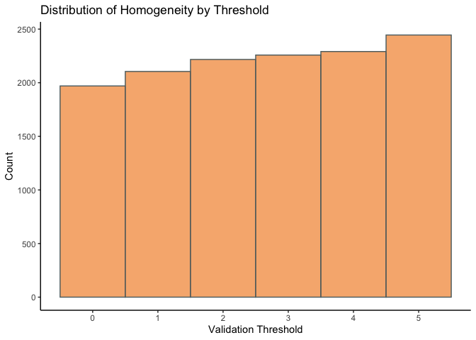

Validation Thresholds Analysis
==============================

Load packages
-------------

``` r
library(dplyr)
library(purrr)
library(tidyr)
library(ggplot2)
library(hash)
```

Constants
---------

``` r
# Validation details
MAX_THRESHOLD <- 5
THRESHOLD_INDEX <- 1:(MAX_THRESHOLD + 1)

# Colors for plotting
COLORS <- hash()
COLORS[["WHITE"]] <- "#FFFFFF"
COLORS[["BLACK"]] <- "#2F2F2F"
COLORS[["GRAY"]] <- "#5C6D70"
COLORS[["BLUE"]] <- "#0E79B2"
COLORS[["GREEN"]] <- "#6FD08C"
COLORS[["ORANGE"]] <- "#F39237"
```

Begin by setting the working directory and important top-level paths to
data and loading necessary packages.

-   NOTE: This will be changed to dynamically account for the package
    `shlab.imgct` via its GitHub instance later. For now, it is using
    development loading.

``` r
# Set the working directory to be part of S Drive (may make dynamic later?)
# Whilst not dynamic, change for own session if mount point is not equivalent on
# local machine
shared_dir <- "~/Projects/shlab/mounts/imgct"
package_dir <- "~/Projects/shlab"

datapath <- file.path(shared_dir, "csn_images")
imgct_package_path <- file.path(package_dir, "shlab.imgct")

# Make sure that devtools, tidyverse are installed before this call
devtools::load_all(imgct_package_path)
```

Load the dataframe containing each participant and validation totals
under the column header named `total_valid`.

``` r
valid_df <- shlab.imgct::validate_all_participants(datapath)
```

Plot the distribution of validation counts across participants.

``` r
p <- ggplot(valid_df, aes(x=total_valid)) + 
  geom_histogram(binwidth=1, color=COLORS[["GRAY"]], fill=COLORS[["BLUE"]], alpha=0.7)

p + labs(title="Distribution of Validation Counts", x="Total Valid", y="Count") +
  scale_x_continuous(breaks=c(0,1,2,3,4,5)) +
  theme_classic() +
  theme(legend.position="top")
```


Categorize at each threshold and assign to list, where list element
indices are threshold values plus one (to be R-like)

``` r
ct_df_list <- list()
ct_df_list <- purrr::map(THRESHOLD_INDEX, function(x) {
  th <- x - 1
  df <- shlab.imgct::categorize(datapath, threshold = th)
  df$threshold <- as.factor(th)
  ct_df_list[[x]] <- df
})
```

Bind rows of the dataframes from the above list to make a single
dataframe with “image\_id” and “threshold” behaving as a multi-index of
sorts for plotting and analysis. Also, create dataframe “mu” of means of
ratings per threshold.

``` r
ct_df_bind <- dplyr::bind_rows(ct_df_list[THRESHOLD_INDEX]) %>%
  dplyr::arrange(desc(threshold))

mu <- ct_df_bind %>%
  dplyr::group_by(threshold) %>% 
  dplyr::summarise(mu_ratings = mean(n_ratings), .groups = "drop") %>%
  dplyr::arrange(desc(threshold))
```

Plot distribution of rating counts relative to each threshold with
means.

``` r
p <- ggplot(ct_df_bind , aes(x=n_ratings, fill=threshold)) + 
  geom_histogram(binwidth=1, color=COLORS[["GRAY"]], alpha=0.5, aes(y = ..density..), position="identity") +
  geom_vline(data=mu, aes(xintercept=mu_ratings, color=threshold),
             linetype="dashed")

p + labs(title="Distribution of Image Ratings", x="Number of Ratings", y="Density") +
  scale_x_continuous(breaks=c(0,2,4,6,8,10,12)) +
  theme_classic() +
  theme(legend.position="top")
```


Above is the distribution of rating counts per image across the six
possible validation thresholds. As expected, increasing values of
threshold from 0 to 5 move the density of ratings leftward. I’ve
included vertical dashed lines representing means of ratings for each
threshold, where the line color and shade color of bars match. Some
thoughts:

1.  Clearly, we can’t use a threshold of 0.
2.  A threshold of 1, 2, or 3 gets us in the ballpark of about 8-9
    ratings per image on average. A threshold of 4 gets us down to 7-8
    ratings per image, and 5 gets us just below 6 ratings per image.
3.  The variance on a validation threshold of 5 is clearly massive, and
    is the only threshold to lower the number of ratings for any block
    to sub-4.
4.  Thresholds of 3 or 4 will likely be our best bet, but will wait to
    further evaluate which of those based on the relative heterogeneity
    distributions.

Calculate heterogeneity indices
-------------------------------

For all rows in the binded dataframe, calculate the htg\_index and
assign a column for it.

``` r
htg_df <- ct_df_bind %>%
  dplyr::mutate(
    htg_index = select(., -c(image_id, n_ratings, threshold)) %>%
      purrr::pmap_dbl(~shlab.imgct::calculate_htg_index(c(...)))
    )

head(htg_df)
```

    ## # A tibble: 6 x 9
    ##   image_id Person `Animal/Plant` Object Place Other n_ratings threshold
    ##   <chr>     <int>          <int>  <int> <int> <int>     <int> <fct>    
    ## 1 IAPS_10…      0              4      0     0     0         4 5        
    ## 2 IAPS_13…      0              5      0     0     0         5 5        
    ## 3 IAPS_13…      0              5      0     0     0         5 5        
    ## 4 IAPS_16…      0              5      0     0     0         5 5        
    ## 5 IAPS_16…      0              5      0     0     0         5 5        
    ## 6 IAPS_17…      0              5      0     0     0         5 5        
    ## # … with 1 more variable: htg_index <dbl>

Below are two other visualizations:

1.  The scatter plot visualization we discussed that gives a sense of
    how heterogeneity changes with increasing thresholds of validation,
    and
2.  The distribution of counts of fully homogeneous responses, where

Heterogeneity speaks to the level of variation among ratings for a given
image in the normalized range \[0,1\], where 0 is fully homogeneous and
0 is fully heterogeneous.

In (1) I’ve included the number of ratings per image as a factor,
color-coded in the legend to the right. It further demonstrates that
thresholds of 1, 2, and 5 are probably not ideal, while 3 or 4 look like
prime candidates. For reference, noting exception of one participant
thrown out during cleaning for the multi-selection issue: - Threshold of
3 leaves of us with 147 participants’ responses out of 187, so 78.6% of
responses - Threshold of 4 leaves us with 136 participants’ responses
out of 187, so 72.7% of responses

``` r
factored_htg_df <- htg_df %>%
  dplyr::mutate_at(vars(n_ratings), list(~ as.factor(.x)))

p <- ggplot(factored_htg_df, aes(x=threshold, y=htg_index, color=n_ratings)) + 
  geom_point(alpha=.3)

p <- p + labs(title="Distribution of Heterogeneity By Threshold", x="Validation Threshold", y="Heterogeneity Index") +
  theme_classic() +
  theme(legend.position="right")

p
```


### Plot Heterogeneity given Threshold

Look at Validation Threshold 3 & 4

``` r
threshold_filter <- c(3,4)

htg_pivot_df <- htg_df %>%
  dplyr::filter(threshold %in% threshold_filter) %>%
  tidyr::pivot_wider(
    id_cols = image_id,
    names_from = c(threshold),
    names_prefix = c("th_"),
    names_sort = TRUE,
    values_from = c(htg_index, n_ratings)
  ) %>%
  dplyr::mutate(
    htg_diff = htg_index_th_4 - htg_index_th_3,
    n_ratings_diff = n_ratings_th_4 - n_ratings_th_3
  ) 

p <- ggplot(htg_pivot_df, aes(x=htg_index_th_4, y=htg_index_th_3, size = n_ratings_diff)) +
  geom_point(color = COLORS[["ORANGE"]], alpha = 0.25)

p <- p + labs(
    title = "Heteogeneity Index Comparison, Validation Thresholds (3 vs. 4)",
    x = "Heterogeneity (Validation 4+ of 5)",
    y = "Heterogeneity (Validation 3+ of 5)",
    size = expression(paste(Delta, "n_ratings"))
  ) +
  scale_size_continuous(range = c(2,.5)) +
  theme_classic() +
  theme(
    legend.position = "right"
  )

p
```


### Plot Differences in Heterogeneity

Consider both directional changes in heterogeneity and number of ratings
between validation threshold values

``` r
htg_diff_all_df <- htg_pivot_df %>%
  dplyr::arrange(desc(-htg_diff)) %>%
  dplyr::mutate(image_sort_id = match(image_id, unique(image_id))) %>%
  dplyr::relocate(image_sort_id, .after = image_id) %>%
  dplyr::select(!contains("_th_"))

htg_diff_nonzero_df <- htg_pivot_df %>%
  dplyr::filter(htg_diff != 0) %>%
  dplyr::arrange(desc(-htg_diff)) %>%
  dplyr::mutate(image_sort_id = match(image_id, unique(image_id))) %>%
  dplyr::relocate(image_sort_id, .after = image_id) %>%
  dplyr::select(!contains("_th_"))
  
head(htg_diff_all_df) 
```

    ## # A tibble: 6 x 4
    ##   image_id                     image_sort_id htg_diff n_ratings_diff
    ##   <chr>                                <int>    <dbl>          <int>
    ## 1 NAPS_BE_landscapes_132_h.jpg             1   -0.388             -2
    ## 2 IAPS_9830.jpg                            2   -0.309             -2
    ## 3 IAPS_7340.jpg                            3   -0.306             -1
    ## 4 NAPS_BE_objects_049_h.jpg                4   -0.306             -1
    ## 5 NAPS_BE_people_168_h.jpg                 5   -0.306             -1
    ## 6 OASIS_dessert_1.jpg                      6   -0.306             -1

``` r
p <- ggplot(htg_diff_all_df, aes(x=image_sort_id, y=htg_diff, color=n_ratings_diff)) + 
  geom_col(alpha=.4)

p <- p + labs(
    title="Heterogeneity Index Difference Between Validation Thresholds 3 & 4", 
    x="Images", 
    y="Heterogeneity Index Difference",
    color=expression(paste(Delta, "n_ratings"))
  ) +
  scale_color_gradient(low = COLORS[["GREEN"]], high = COLORS[["BLUE"]]) +
  theme_classic() +
  theme(
    #axis.text.x = element_blank(),
    legend.position="right"
  )

p
```


``` r
p <- ggplot(htg_diff_nonzero_df, aes(x=image_sort_id, y=htg_diff, color=n_ratings_diff)) + 
  geom_col(alpha=.4)

p <- p + labs(
    title="Heterogeneity Index Difference (Nonzero) Between Validation Thresholds 3 & 4", 
    x="Images", 
    y="Heterogeneity Index Difference",
    color=expression(paste(Delta, "n_ratings"))
  ) +
  scale_color_gradient(low = COLORS[["GREEN"]], high = COLORS[["BLUE"]]) +
  theme_classic() +
  theme(
    #axis.text.x = element_blank(),
    legend.position="right"
  )

p
```


Filter for heterogeneity indices of 0, meaning fully homogenous.

``` r
htg_0_df <- htg_df %>% 
  dplyr::filter(htg_index == 0) %>%
  dplyr::mutate_at(vars(threshold), funs(as.integer(as.character(.))))
```

Plot the histogram of counts for homogeneity by varying validation
threshold.

``` r
p <- ggplot(data = htg_0_df , aes(x=threshold)) + 
  geom_histogram(binwidth=1, color=COLORS[["GRAY"]], fill=COLORS[["ORANGE"]], alpha=0.7)

p <- p + labs(title="Distribution of Homogeneity by Threshold", x="Validation Threshold", y="Count") +
  scale_x_continuous(breaks=c(0,1,2,3,4,5)) +
  theme_classic()
p
```



Participant Response Quality Analysis
-------------------------------------

Begin by loading all clean blocks and binding them.

``` r
clean_responses_df_list <- shlab.imgct::load_all_clean_blocks(datapath) 
```

Rename all columns to be the trial response number for each participant,
inclusive of validation images, as opposed to the particular image name.
This avoids confusion, as in this dataframe the images are not
consistent across blocks of participants.

``` r
# from first dataframe element in list, simply extract old_names,
# then determine new_names via "trial_" pattern that applies generally
old_names <- names(clean_responses_df_list[[1]] %>% dplyr::select(-participantCode))
new_names <- paste("trial", which(old_names %in% old_names), sep="_")

all_responses_df <- clean_responses_df_list %>%
  purrr::map(function(df) {
    df %>% dplyr::rename_with(
      ~ new_names, 
      contains(c(".jpg", ".jpeg", ".png"))
    )
  }) %>%
  dplyr::bind_rows()

head(all_responses_df)
```

    ## # A tibble: 6 x 206
    ##   participantCode trial_1 trial_2 trial_3 trial_4 trial_5 trial_6 trial_7
    ##   <chr>           <chr>   <chr>   <chr>   <chr>   <chr>   <chr>   <chr>  
    ## 1 m0140672qeh055… 1       5       4       4       1       3       1      
    ## 2 c0328416ctt066… 1       3       3       3       3       3       1      
    ## 3 m0238268rxg027… 1       5       4       3       1       3       1      
    ## 4 y0425551xgm026… 1       3       3       3       1       3       1      
    ## 5 t0870125ahy070… 1       3       4       3       1       3       1      
    ## 6 p0352221sbz078… 1       3       3       3       1       3       1      
    ## # … with 198 more variables: trial_8 <chr>, trial_9 <chr>, trial_10 <chr>,
    ## #   trial_11 <chr>, trial_12 <chr>, trial_13 <chr>, trial_14 <chr>,
    ## #   trial_15 <chr>, trial_16 <chr>, trial_17 <chr>, trial_18 <chr>,
    ## #   trial_19 <chr>, trial_20 <chr>, trial_21 <chr>, trial_22 <chr>,
    ## #   trial_23 <chr>, trial_24 <chr>, trial_25 <chr>, trial_26 <chr>,
    ## #   trial_27 <chr>, trial_28 <chr>, trial_29 <chr>, trial_30 <chr>,
    ## #   trial_31 <chr>, trial_32 <chr>, trial_33 <chr>, trial_34 <chr>,
    ## #   trial_35 <chr>, trial_36 <chr>, trial_37 <chr>, trial_38 <chr>,
    ## #   trial_39 <chr>, trial_40 <chr>, trial_41 <chr>, trial_42 <chr>,
    ## #   trial_43 <chr>, trial_44 <chr>, trial_45 <chr>, trial_46 <chr>,
    ## #   trial_47 <chr>, trial_48 <chr>, trial_49 <chr>, trial_50 <chr>,
    ## #   trial_51 <chr>, trial_52 <chr>, trial_53 <chr>, trial_54 <chr>,
    ## #   trial_55 <chr>, trial_56 <chr>, trial_57 <chr>, trial_58 <chr>,
    ## #   trial_59 <chr>, trial_60 <chr>, trial_61 <chr>, trial_62 <chr>,
    ## #   trial_63 <chr>, trial_64 <chr>, trial_65 <chr>, trial_66 <chr>,
    ## #   trial_67 <chr>, trial_68 <chr>, trial_69 <chr>, trial_70 <chr>,
    ## #   trial_71 <chr>, trial_72 <chr>, trial_73 <chr>, trial_74 <chr>,
    ## #   trial_75 <chr>, trial_76 <chr>, trial_77 <chr>, trial_78 <chr>,
    ## #   trial_79 <chr>, trial_80 <chr>, trial_81 <chr>, trial_82 <chr>,
    ## #   trial_83 <chr>, trial_84 <chr>, trial_85 <chr>, trial_86 <chr>,
    ## #   trial_87 <chr>, trial_88 <chr>, trial_89 <chr>, trial_90 <chr>,
    ## #   trial_91 <chr>, trial_92 <chr>, trial_93 <chr>, trial_94 <chr>,
    ## #   trial_95 <chr>, trial_96 <chr>, trial_97 <chr>, trial_98 <chr>,
    ## #   trial_99 <chr>, trial_100 <chr>, trial_101 <chr>, trial_102 <chr>,
    ## #   trial_103 <chr>, trial_104 <chr>, trial_105 <chr>, trial_106 <chr>,
    ## #   trial_107 <chr>, …

With a function to get the lengths of consecutive runs for a given
vector, compute the longest (max) run. Apply this to a widened ratings
dataframe that groups by participantCode, and then summarizes the
consecutive maximum runs on ratings for each participant.

``` r
get_consec_max <- function(vec) {
    with(rle(vec), max(lengths))
}

ratings_df <- all_responses_df %>%
  tidyr::pivot_longer(
    cols=starts_with("trial_"),
    names_to="trial",
    names_prefix="trial_",
    values_to="rating"
  ) %>%
  group_by(participantCode)

consecutives_df <- ratings_df %>% 
  dplyr::summarise(consec_max = get_consec_max(rating), .groups = "drop") %>%
  dplyr::arrange(desc(consec_max))

head(consecutives_df)
```

    ## # A tibble: 6 x 2
    ##   participantCode    consec_max
    ##   <chr>                   <int>
    ## 1 t0450684npi0783816         11
    ## 2 a0431541ptm0366614          9
    ## 3 a0461625jax0076067          9
    ## 4 c0117677feg0421726          9
    ## 5 d0324203mcm0718476          9
    ## 6 d0387373cfe0511541          9
